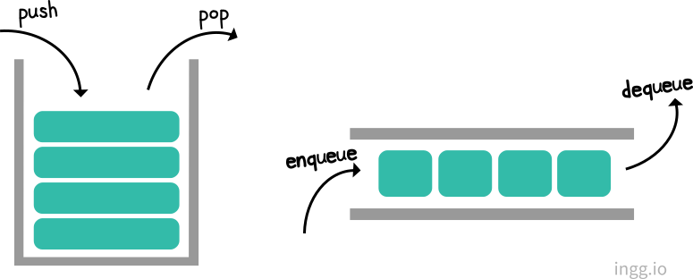
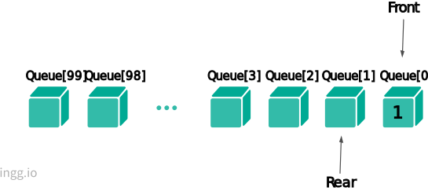
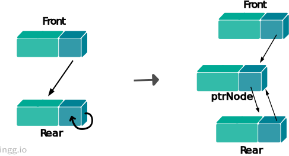

---

### 📌 Contents

1. [스택(Stack)](#stack)
2. [큐(Queue)](#queue)

---

<br>

### <a name="stack"></a>스택(Stack)

<hr>

스택은 **입력과 출력을 한 방향으로 제한한 자료구조**라고 말할 수 있다. 데이터의 삽입과 삭제가 한쪽 끝에서만 이루어진다. 삽입/삭제가 일어나는 쪽을 스택의 **top**이라고 부른다.

- **푸시(push)** : 접시를 찬장에 쌓는다. 즉, 데이터에 순서를 적용해 차례로 저장한다.
- **팝(pop)** : 접시를 사용하기위해 찬장의 가장 위에 있는 접시를 가져온다. 즉, 가장 최신 데이터부터 차례로 가져온다.
- peek : 스택 top의 원소를 제거하지 않고 반환
- empty : 스택이 비었는지 검사

이런 방식을 **LIFO(Last In, First Out)** 이라고 한다. 마지막에 들어간 것이 제일 처음 나온다는 뜻이다.

<br>


```c
push("A");
push("B");
push("C");
push("D");                  //스택의 상태는 (1)이 됨

char *str1 = peek();        //str1은 "D"가 됨
char *str2 = pop();         //str2는 "D"가 되고 스택의 상태는 (2)로 바뀜
push("E");                  //스택의 상태가 (3)으로 바뀜
```

<br>

### 스택 구현

<hr>

#### 링크드 리스트를 사용하는 스택의 구조체 정의

```c
typedef struct _NODE {
    int data;
    struct _NODE *next;
} NODE;
```

#### 스택 초기화 코드

```c
void InitializeStack(void)
{
    head = (NODE *)malloc(sizeof(NODE));
    end = (NODE *)malloc(sizeof(NODE));
    head->next = end;
    end->next = end;
}
```

현재는 스택이 비워져 있으므로 `head->next` 값은 _end_ 를 가리키고, `end->next`값은 _end_ 를 가리킨다.

#### Push()함수

```c
void Push(int num)
{
    ptrNode = (NODE *)malloc(sizeof(NODE));
    ptrNode->data = num;
    ptrNode->next = head->next;
    head->next = ptrNode;
}
```

매개변수로 int 자료형 데이터를 받고 이것은 스택에 저장될 데이터가 된다. 새로 생성한 노드는 ptrNode로 가리키고, `ptrNode->data` 값에 매개변수로 받은 int 자료형 데이터를 저장한다. 그리고 새로 생성한 노드의 _**next**_ 값이 _**head**_ 노드의 _**next**_ 값이 가리키는 노드가 되게 한다. _**head**_ 노드의 _**next**_ 값은 ptrNode값으로 한다.

<br>

<center></center>

여기서 `ptr->next = head->next`를 실행하면 `head->next`가 스택의 가장 윗부분 노드를 가리키므로 새로운 노드가 추가되면 해당 노드의 _**next**_ 값에 `head->next`값에 저장된 주소를 넣는다. 그러면 새로 추가된 노드의 _**next**_ 값은 이전에 추가된 노드를 가리키게 된다. 그다음 `head->next`값을 현재 새로 추가한 노드로 만든다. 따라서 `head->next`값은 다시 가장 윗부분 노드를 가리킨다.

#### Pop() 함수

```c
int Pop(void)
{
    int ret;
    ptrNode = head->next;
    head->next = head->next->next;
    ret = ptrNode->data;
    free(ptrNode);

    return ret;
}
```

매개변수가 없는 대신 반환 값이 있는데 이 값이 스택에 저장된 최상위 값이 된다.

<br>

<center></center>


`ptrNode = head->next`가 되면 ptrNode는 `head->next`가 가리키는 노드를 가리키게 되고 이 노드는 **pop**해야할 노드이다. 그리고 `head->next`에 `head->next->next`값을 넣으면 `head->next`는 위에서 두번째에 있는 노드를 가리키게 된다.

<br>

#### 연결리스트를 사용한 스택 알고리즘

실제 스택 구조를 구현한 전체 소스코드는 다음과 같다.

```c
#include <stdio.h>
#include <stdlib.h>

typedef struct _NODE {
    int data;
    struct _NODE *next;
} NODE;

NODE *head, *end;
NODE *ptrNode;

void InitializeStack(void);     //스택초기화
void Push(int);                 //데이터삽입
int Pop(void);                  //데이터삭제
void DisplayStack(void);        //스택을 보여줌

void InitializeStack(void)
{
    head = (NODE *)malloc(sizeof(NODE));
    end = (NODE *)malloc(sizeof(NODE));
    head->next = end;
    end->next = end;
}

void Push(int num)
{
    ptrNode = (NODE *)malloc(sizeof(NODE));
    ptrNode->data = num;
    ptrNode->next = head->next;
    head->next = ptrNode;
}

int Pop(void)
{
    int ret;
    ptrNode = head->next;
    head->next = head->next->next;
    ret = ptrNode->data;
    free(ptrNode);

    return ret;
}

void DisplayStack(void)
{
    NODE *indexNode;
    printf("head->");

    for(indexNode = head->next; indexNode != end; indexNode = indexNode->next)
        printf("%d->", indexNode->data);

    printf("end \n");
}

void main()
{
    int ret;
    InitializeStack();

    Push(1);
    Push(2);
    Push(8);
    Push(10);
    Push(13);

    printf("다섯번의 Push() 함수 호출 후 결과\n");
    DisplayStack();

    ret = Pop();
    ret = Pop();
    ret = Pop();

    printf("\n세 번의 Pop() 함수 호출 후 결과\n");
    DisplayStack();
}
```

- 실행 결과

```
다섯번의 Push() 함수 호출 후 결과
head->13->10->8->2->1->end

세 번의 Pop() 함수 호출 후 결과
head->2->1->end
```

세번의 **Pop()** 함수를 호출해서, 위에 있는 _13, 10, 8_ 이 스택에서 제거되고 _2, 1_ 이 남은 결과이다.

<br>

### <a name="queue"></a>큐(Queue)

<hr>

큐(queue)는 대기행렬이라고 볼 수 있다. 역시 스택과 마찬가지로 일종의 리스트이다. 단, 데이터의 삽입은 한쪽 끝에서, 삭제는 반대쪽 끝에서만 일어난다. 삽입이 일어나는 쪽을 **rear**, 삭제가 일어나는 쪽을 **front**라고 부른다.

- **insert, enqueue, put** : 큐의 rear에 새로운 원소를 삽입하는 연산
- **remove, dequeue, get** : 큐의 front에 있는 원소를 큐로부터 삭제하고 반환하는 연산

큐는 **FIFO(First In, First Out)** 방식이다. 처음 저장한 데이터를 처음 사용한다는 뜻이다.

<br>


<br>

### 배열을 이용한 큐의 구현

<hr>

큐는 스택과 달리 배열을 사용하는 것이 좀 더 편하다. 먼저 배열 하나를 정의하여 큐를 위한 자료구조를 준비한다.

```c
int Queue[MAX];
```

<br>

#### 초기화 함수

```c
void InitializeQueue(void)
{
    Front = Rear = 0;
}
```


큐의 앞과 뒤를 가리키는 **front**와 **rear**변수값을 모두 **0**으로 초기화한다. 100개의 항목을 갖는 배열 Queue에서 front와 rear변수는 첫 번째 인덱스를 가리킨다.

<br>

#### Put() 함수

```c
void Put(int num)
{
    Queue[Rear++] = num;

    if(Rear >= MAX)
        Rear = 0;
}
```

현재 Queue 값에 넣으려는 데이터를 변수 Rear값이 가리키는 곳에 저장하고 Rear 변수값을 하나 증가시킨다. 그러면 Rear는 다음 배열 공간을 가리킨다. 즉 **Put(1)** 함수가 실행되면 1이 Queue[0]에 저장되며 0을 가리키는 변수 Rear는 1증가한다.



만약 변수 Rear가 배열의 크기(MAX)와 같거나 크면 Rear를 0으로 만들어서 다시 배열 Queue의 인덱스가 0부터 시작하도록 한다.

<br>

#### Get() 함수

```c
int Get(void)
{
    int ret;
    ret = Queue[Front++];

    if(Front >= MAX)
        Front = 0;

    return ret;
}
```

배열 Queue에서 Front가 가리키는 곳의 데이터를 ret에 저장하고 반환한다. 그리고 **Put()** 함수의 Rear에서 처럼 만약 Front변수가 배열의 크기보다 크면 0으로 초기화한다.


<br>

**Put()** 함수로 1, 2, 8, 10을 큐에 저장하고 저장되면서 Rear값이 바뀐다. 그리고 **Get()** 함수를 호출하면 큐의 처음 데이터인 Front가 가리키는 데이터 1을 반환하고 Front값이 하나 증가한다.

즉, **Put()** 함수는 매개변수로 받은 int자료형 데이터를 Rear가 가리키는 큐에 저장하고 Rear값을 하나 증가시킨다. **Get()** 함수는 반대로 Front가 가리키는 큐 안의 데이터를 가져온다.

<br>

#### 배열을 사용한 큐 알고리즘

배열을 사용한 큐 자료구조를 이용하는 전체 코드는 다음과 같다.

```c
#include <stdio.h>

#define MAX 100

int Queue[MAX];
int Front, Rear;

void InitializeQueue(void);
void Put(int);
int Get(void);
void DisplayQueue(void);

void InitializeQueue(void)
{
    Front = Rear = 0;
}

void Put(int num)
{
    Queue[Rear++] = num;

    if(Rear >= MAX)
        Rear = 0;
}

int Get(void)
{
    int ret;
    ret = Queue[Front++];

    if(Front >= MAX)
        Front = 0;

    return ret;
}

void DisplayQueue(void)
{
    int i;
    printf("Front->");

    for(i = Front; i < Rear; i++)
        printf("%d->", Queue[i]);

    printf("Rear");
}

void main()
{
    int ret;
    InitializeQueue();

    Put(1);
    Put(2);
    Put(8);
    Put(10);
    Put(13);

    printf("다섯 번의 Put() 함수 호출 후 결과\n");
    DisplayQueue();

    ret = Get();
    ret = Get();
    ret = Get();

    printf("\n세 번의 Get() 함수 호출 후 결과\n");
    DisplayQueue();

    printf("\n두 번의 Get() 함수 호출 후 결과\n");

    ret = Get();
    ret = Get();
    DisplayQueue();
}
```

- 실행 결과

```
다섯 번의 Put() 함수 호출 후 결과
Front->1->2->8->10->13->Rear
세 번의 Get() 함수 호출 후 결과
Front->10->13->Rear
두 번의 Get() 함수 호출 후 결과
```

<br>

### 연결리스트를 사용한 큐의 구현

<hr>

큐는 배열로 사용하는 것이 구현하기도 편하고 관리도 편하지만 연결리스트를 사용하여 만들 수도 있다.

#### 노드 정의

```c
typedef struct _NODE {
    int data;
    struct _NODE *next;
} NODE;
```

링크 하나, 저장할 데이터가 한 개인 구조이다.

<br>

#### 초기화 함수

```c
void InitializeQueue(void)
{
    Front = (NODE *)malloc(sizeof(NODE));
    Rear = (NODE *)malloc(sizeof(NODE));
    Front->next = Rear;
    Rear->next = Rear;
}
```

front와 rear에 메모리를 할당한 뒤 링크를 서로 연결시켜 큐를 초기화한다.

<br>

#### Put() 함수

```c
void Put(int num)
{
    ptrNode = (NODE *)malloc(sizeof(NODE));
    ptrNode->data = num;

    if(Front->next == Rear){
        Front->next = ptrNode;
        ptrNode->next = Rear;
        Rear->next = ptrNode;
    }else {
        Rear->next->next = ptrNode;
        ptrNode->next = Rear;
        Rear->next = ptrNode;
    }
}
```



큐가 비어있는 경우 (`Front->next`가 Rear를 가리키는 경우) `Front->next`값이 새로 추가되는 노드인 ptrNode를 가리키게 한다. 그리고 `ptrNode->next`는 Rear를 가리키게 하고 `Rear->next`는 ptrNode를 가리키게 한다.

<br>


기존의 노드가 존재하는 경우는 `Rear->next->next`값이 ptrNode를 가리키게하고(1) `ptrNode->next`는 Rear값을 가리키게 하고(2) `Rear->next`는 새로운 노드 ptrNode를 가리키게 한다(3).

<br>

#### Get() 함수

```c
int Get(void)
{
    int ret;
    NODE *deleteNode;
    printf("\n");

    if(Front->next == Rear)
        printf("Queue is Empty\n");
    else{
        deleteNode = Front->next;
        Front->next = deleteNode->next;
        ret = deleteNode->data;
        printf("get() : %d", ret);

        free(deleteNode);
    }
    return ret;
}
```


먼저 큐가 비었는지 확인하고 비어있지 않으면 deleteNode값이 `Front->next`값을 가리키게 하고 `Front->next`값이 `deleteNode->next`값을 가리키게 한다. 그리고 deleteNode값의 데이터를 출력하고 **_free( )_** 함수로 노드를 제거한다.

<br>

#### DisplayQueue() 함수

```c
void DisplayQueue(void)
{
    NODE *ptrTemp;

    if(Front->next != Rear){
        for(ptrTemp = Front->next; ptrTemp->next != Rear; ptrTemp = ptrTemp->next){
            printf("%d->", ptrTemp->data);
        }

        printf("%d", ptrTemp->data);
    }
    else if(Front->next == Rear)
        printf("Queue is Empty\n");
}
```

`Front->next`값이 Rear를 가리킬 때까지 연결리스트를 이동하며 각 노드 데이터를 출력한다.

<br>

#### 연결리스트를 사용한 큐 알고리즘

연결리스트를 사용한 큐의 전체 코드는 다음과 같다.

```c
#include <stdio.h>
#include <stdlib.h>

typedef struct _NODE {
    int data;
    struct _NODE *next;
} NODE;

NODE *Front, *Rear;
NODE *ptrNode;

void InitializeQueue(void);
void Put(int);
int Get(void);
void DisplayQueue(void);

void InitializeQueue(void)
{
    Front = (NODE *)malloc(sizeof(NODE));
    Rear = (NODE *)malloc(sizeof(NODE));
    Front->next = Rear;
    Rear->next = Rear;
}

void Put(int num)
{
    ptrNode = (NODE *)malloc(sizeof(NODE));
    ptrNode->data = num;

    if(Front->next == Rear){
        Front->next = ptrNode;
        ptrNode->next = Rear;
        Rear->next = ptrNode;
    }else {
        Rear->next->next = ptrNode;
        ptrNode->next = Rear;
        Rear->next = ptrNode;
    }
}

int Get(void)
{
    int ret;
    NODE *deleteNode;
    printf("\n");

    if(Front->next == Rear)
        printf("Queue is Empty\n");
    else{
        deleteNode = Front->next;
        Front->next = deleteNode->next;
        ret = deleteNode->data;
        printf("get() : %d", ret);

        free(deleteNode);
    }
    return ret;
}

void DisplayQueue(void)
{
    NODE *ptrTemp;

    if(Front->next != Rear){
        for(ptrTemp = Front->next; ptrTemp->next != Rear; ptrTemp = ptrTemp->next){
            printf("%d->", ptrTemp->data);
        }

        printf("%d", ptrTemp->data);
    }
    else if(Front->next == Rear)
        printf("Queue is Empty\n");
}

void main()
{
    int ret;
    InitializeQueue();
    printf("Put() 함수 호출하기\n");

    Put(1);
    Put(2);
    Put(8);
    Put(10);
    Put(13);

    printf("다섯 번의 Put() 함수 호출 결과: ");
    DisplayQueue();

    ret = Get();
    ret = Get();
    ret = Get();

    printf("\n세 번의 Get() 함수 호출 결과: ");
    DisplayQueue();

    ret = Get();
    ret = Get();

    printf("\n두 번의 Get() 함수 호출 결과: ");
    DisplayQueue();
}
```

- 실행 결과

```
Put() 함수 호출하기
다섯 번의 Put() 함수 호출 결과: 1->2->8->10->13
get() : 1
get() : 2
get() : 8
세 번의 Get() 함수 호출 결과: 10->13
get() : 10
get() : 13
두 번의 Get() 함수 호출 결과: Queue is Empty
```
