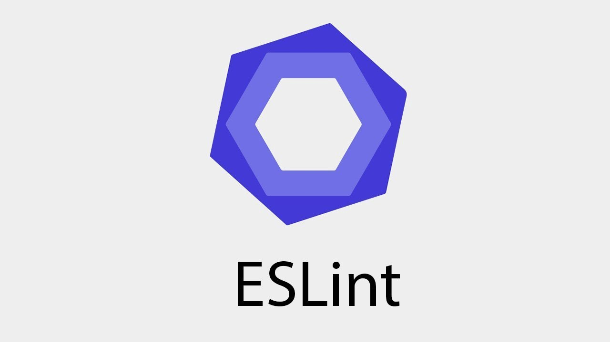

Lint는 보푸라기라는 뜻인데 프로그래밍 쪽에서는 에러가 있는 코드에 표시를 달아놓는 것을 의미한다. 즉 ESLint는 자바스크립트 문법 중 에러가 있는 곳에 표시를 달아놓는 도구를 의미한다.

코드를 분석해 문법적인 오류나 안티 패턴을 찾아주고 일관된 코드 스타일을 유지(포맷팅)하여 개발자가 쉽게 읽도록 코드를 만들어준다.

<br>

---

### 📌 Contents

1. [Intro](#usage)
2. [Rules](#rules)
3. [Prettier와 통합하기](#prettier)

---

<br>

### <a name="usage"></a>Intro

---

1. _npm_ 또는 _yarn_ 으로 설치한다. `--global`옵션을 붙여 전역으로 설치할 수도 있지만 ESLint에서는 권장하지 않는다.

```
$ npm install eslint --save-dev

// or

$ yarn add eslint --dev
```

2. 구성 파일을 설정한다. 답변에 따라 `.eslintrc`파일이 생성된다.

```
$ npx eslint --init
```

3. 파일또는 디렉토리에서 실행한다.

```
$ npx eslint <yourfile.js>
```

<br>

### <a name="rules"></a>Rules

---

```js
// .eslintrc.js
module.exports = {
  // ...
  extends: "eslint:recommended",
  rules: {
    "no-extra-semi": "error",
  },
};
```

**_"eslint:recommended"_** 는 [rules page](https://eslint.org/docs/rules/)에 있는 체크표시(☑️)된 모든 규칙들을 활성화한다. 이 설정 외에 규칙이 더 필요하면 `rules` 속성에 추가해서 확장할 수 있다.

또한 **ESLint**에는 수정 가능한 규칙과 불가능한 규칙이 있다. 렌치표시(🔧)가 붙은 것은 `--fix`옵션으로 자동 수정할 수 있는 규칙이다.

**_"no-extra-semi"_** 는 규칙 이름이고 규칙에 설정하는 **값**은 3가지로 나뉜다.

- `"off"` 또는 `0` : 끔
- `"warn"` 또는 `1` : 경고
- `"error"` 또는 `2` : 오류

<br>

> #### ESLint는 스타일 가이드를 좀 더 편리하게 적용하기 위해 사용하기도 한다. 많이 쓰이는 것은 [Airbnb Style Guide](https://github.com/airbnb/javascript), [Google Style Guide](https://github.com/google/eslint-config-google) 등이 있다.

#### Airbnb Style Guide 설치 및 사용

Airbnb ESLint에는 **_eslint-config-airbnb_** 와 **_eslint-config-airbnb-base_** 가 있는데 [base](https://www.npmjs.com/package/eslint-config-airbnb-base)는 리액트 관련 규칙을 포함하지 않는 것이다. base로 설치하려면 아래 명령어에서 _airbnb_ 뒤에 _-base_ 를 붙인다.

1. 다음 명령어로 사전에 설치해야하는 패키지를 확인한다.

```
$ npm info "eslint-config-airbnb@latest" peerDependencies
```

2. **npm 5+** 이상을 사용한다면 다음 명령어로 설치하면 된다.

```
$ npx install-peerdeps --dev eslint-config-airbnb
```

3. `.eslintrc` 파일에 `"extends": "airbnb"` 를 추가한다. (base를 사용한다면 `"airbnb-base"`를 추가한다.)

<br>

#### Google Style Guide 설치 및 사용

```
$ npm install --save-dev eslint eslint-config-google
```

```js{3}
// .eslintrc.js
{
  "extends": "google",
  "rules": {
    // Additional, per-project rules...
  }
}
```

아래와같이 `google` 과 `eslint:recommended`를 같이 사용할 수도 있다.

```js{2}
{
  "extends": ["eslint:recommended", "google"],
  "rules": {
    // Additional, per-project rules...
  }
}
```

<br>

### <a name="prettier"></a>Prettier와 통합하기

---

[**프리티어(Prettier)**](https://prettier.io/)는 **코드 포매터(code formatter)** 이다. 포맷팅을 맡더라도 코드 품질같은 검사는 **ESLint** 몫이기 때문에 주로 둘을 통합하여 사용한다.

#### eslint-config-prettier

프리티어를 사용할 때 ESLint가 코딩스타일에 관해서는 신경안쓰게하려면
**_eslint-config-prettier_** 를 설치한다. Prettier와 충돌하는 ESLint 규칙을 끄는 역할을 한다.

```
$ npm install --save-dev eslint-config-prettier
```

```js{5}
// .eslintrc.js
{
  extends: [
    "eslint:recommended",
    "eslint-config-prettier"
  ]
}
```

<br>

#### eslint-plugin-prettier

**_eslint-plugin-prettier_** 는 프리티어 규칙을 ESLint 규칙으로 추가하는 플러그인이다. 프리티어의 모든 규칙이 ESLint로 들어오기 때문에 ESLint만 실행하면 된다.

```
$ npm install --save-dev eslint-plugin-prettier
```

이 plugin을 **_eslint-config-prettier_** 와 통합하려면 config-prettier와 plugin-prettier 설치 후에 `recommended`를 사용한다.

- 사용예시

```json{4}
// ex 1)
// .eslintrc.json
{
  "extends": ["plugin:prettier/recommended"]
}
```

```js{4}
// ex 2)
// .eslintrc.js
module.exports = {
	extends: ["airbnb-base", "plugin:prettier/recommended"],
	rules :{
		"no-console": "off"
	}
}
```

<br>

특별한 ESLint 플러그인 (_ex: eslint-plugin-react_)을 지원 하려면 다음과 같이 사용하는 플러그인에 대해 제외할 것을 추가한다.

```
{
  "extends": [
    "plugin:prettier/recommended",
    "prettier/flowtype",
    "prettier/react",
    "prettier/standard"
  ]
}
```

<br>

> References

- [https://eslint.org/](https://eslint.org/docs/user-guide/getting-started)
