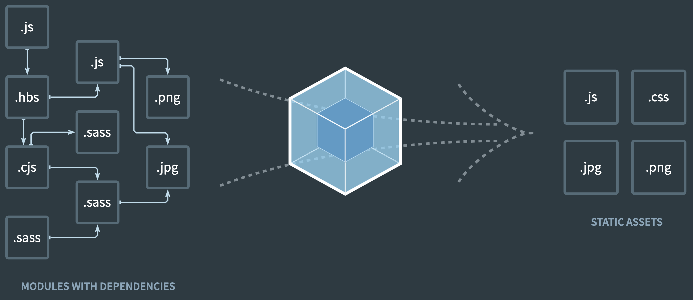
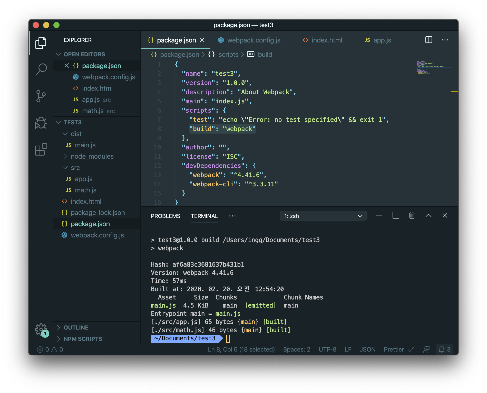

**Webpack**은 여러개 파일을 하나의 파일로 합쳐주는 **모듈 번들러(Module bundler)**이다.<br>

> **Webpack**을 쓰는 이유는 무엇일까?<br>

표준화된 모듈화 기법이 등장한 것은 **ES2015**부터인데, Webpack이 필요한 이유를 알기 위해서는 모듈화 역사를 알아볼 필요가 있다.
<br>

---

### 📌 Content

1. [Basic](#basic)
2. [IIFE](#iife)
3. [CommonJS와 AMD](#cjs-amd)
4. [Webpack](#webpack)

---

<br>

## <a name="basic"></a>1. Basic

### import / export 구문이 없었던 모듈 이전 상황

자바스크립트는 `script` 태그를 사용하여 외부의 스크립트 파일을 가져올 수는 있지만, 파일마다 독립적인 파일 스코프를 갖지 않고 하나의 **전역 객체(Global Object)**를 공유한다.

예를들어 _math.js_ 와 *app.js*를 스크립트 태그에 넣는다고 하자. *math.js*을 먼저 로딩하고 *app.js*을 로딩한다.

```html
<!DOCTYPE html>
<html>
  <head> </head>
  <body>
    <script src="./src/math.js"></script>
    <script src="./src/app.js"></script>
  </body>
</html>
```

이때 각각 같은 변수이름을 사용한다면 가장 뒤에쓰인 스크립트를 기준으로 변수이름이 적용된다.

- _math.js_

```js
function sum(x, y) {
  return x + y
}
```

<br>

- _app.js_

```js
sum(1, 2)

console.log(sum(1, 2)) // 3
```

<br>

### 전역 스코프에 함수가 노출되면 생기는 문제점

여기서 문제는 `sum`이 전역스코프에 노출되는 것이다.

```
sum = 1;

sum(3, 4)	//Uncaught TypeError: sum is not a function
```

만약 _sum_ 에 1을 새롭게 할당한다면 이제는 *sum*이라는 함수를 호출할 수 없는 상황이 된다. 즉, 다른파일에서 같은 변수이름을 쓰면 충돌한다. 이렇게 스코프 문제가 발생하고, 의존성 관리 문제도 해결되지 않으므로 모듈화를 구현하기 어렵다.

<!-- + 의존성 관리와 로드시간문제 -->

<!-- script 태그로 모듈을 가져오는 방식은 파일을 가져올 수 있을 뿐, 함수나 객체를 가져올 수 없다. -->
<br>

## <a name="iife"></a>2. IIFE

**즉시 실행 함수 표현(IIFE, Immediately Invoked Function Expression)**은 정의되자마자 즉시 실행되는 Javascript Function 를 말한다.

```js
・(function() {
  statements
})()
```

<br>

IIFE 내부에서 정의된 변수는 외부 범위에서 접근이 불가능하다.

```js
・(function() {
  var aName = "Mary"
})()

aName // Uncaught ReferenceError: aName is not defined
```

<br>

IIFE를 변수에 할당하면 IIFE 자체는 저장되지 않고, 함수가 실행된 결과만 저장된다.

```js
var result = (function() {
  var name = "Mary"
  return name
})()
// 즉시 결과를 생성
result // "Mary"
```

<br>

IIFE는 스코프 문제를 해결했지만 바로 실행한다는 점에서 모듈화의 해결책은 아니다.
이렇게 모듈기능은 반드시 해결해야할 과제였다. 그래서 제안된 것이 **AMD와 CommonJS**이다.

<br>

## <a name="cjs-amd"></a>3.CommonJS와 AMD

### CommonJS

[CommonJS](http://www.commonjs.org/)는 자바스크립트를 브라우저에서뿐만 아니라, 서버사이드 애플리케이션이나 데스크톱 애플리케이션에서도 사용하려고 조직한 자발적 워킹 그룹이다. 대표적으로 서버 사이드 플랫폼인 **_Node.js_**에서 이를 사용한다.

`exports` 키워드로 모듈을 만들고 `require()` 함수로 임포트하는 방식이다.

1. 전역변수와 지역변수를 분리하여 모듈이 독립적인 실행 영역을 갖게 된다.
2. _script_ 태그로 파일을 가져오는 것이 아니라 필요한 함수나 변수를 가져올 수 있다.
3. *exports*와 *require*를 이용하여 의존성 관리도 편해졌다.

이렇게 **CommonJS**는 모듈화의 조건을 충족시키지만 이 방식은 브라우저에서는 필요한 모듈을 모두 내려받을 때까지 아무것도 할 수 없게 된다는 결정적인 단점이 있었다.

### AMD

**AMD(Asynchronous Module Definition)**는 비동기로 로딩되는 환경에서 모듈을 사용하는 것이 목표다.
이 방식은 `define` 함수 내에 코드를 작성함으로써 스코프 분리가 가능하다.

```
define(['./foo.js', './boo.js'], function(foo, boo){
//
})
```

<!-- 단점 ::: AMD 그리고 이에 기반한 모듈 로더 require.js 에도 문제가 있었습니다. 기술적인 문제라기보다는 레거시의 문제 혹은 대세의 문제였습니다.
첫번째 문제는 서버사이드에서 쓰려고 만든 함수를 브라우저에서 쓰려면 AMD 형식에 맞춰서 다 바꿔주어야 하는 “귀찮음”이 바로 그 문제였습니다. 즉, 같은 내용을 서버사이드 함수로도 쓰고 AMD 형식으로도 써야 합니다. 물론, r.js라는 변환 스크립트를 통해 CJS스타일을 AMD스타일로 변환하는 것을 도와주기는 했습니다만, 모든 상황을 완벽하게 커버하지는 못했습니다.
두번째 문제로, cjs와 amd가 앞다퉈 모듈화기법의 베이스를 만든지 1년 채 안된 2010년 즈음, npm이 등장하고 그때 이후로 많은 개발자들이 자발적으로 node.js의 세계에 자신이 만든 멋진 모듈들을 업로드하기 시작했다는 점입니다. 이들은 대부분 CJS 형식으로 만들어졌습니다. CJS 스타일로 만든 코드를 AMD 스타일로 변환해야할 상황들이 더욱 많아졌습니다.

붉은 선이 npm에 등록된 모듈의 수 입니다. 현재 등록된 모듈의 수만 해도 70만개로, npm 릴리즈 초창기에 해당하는 7년 전에 비해 140배 성장률을 기록하고 있군요.
많은 사람들은 CJS를 사용하고 있었고, 또 그만큼 많은 사람들이 웹에 올리기 위해 AMD 스타일에 맞춰서 변환하고 있었습니다. 무엇인가 변화가 필요했습니다. 귀찮은 과정을 쳐내는, 혹은 통합시켜주는 툴이 필요했습니다 -->
<br>

### ES6 모듈

ES6에서는 **export**를 이용해 모듈로 만들고 **import**로 가져온다.

- **_math.js_**

```js
export function sum(x, y) {
  return x + y
}
```

<br>

- **_app.js_**

```js
import * as math from "./math.js"
// import {sum} from "./math.js"
// sum만 가져오고 싶다면 이렇게 사용할 수도 있다.

console.log(math.sum(1, 2))
```

`import * as name`은 모든 **export**를 가져오고 `name` 매개 변수는 모듈 객체의 이름으로, **export**를 참조하기위한 일종의 네임 스페이스로 사용된다.

ES6에서는 클라이언트 사이드 자바스크립트에서도 동작하는 모듈 기능을 [추가](https://developer.mozilla.org/en-US/docs/Web/JavaScript/Reference/Statements/import)했다. _script_ 태그에 `type="module"` 속성을 추가하면 모듈로 사용할 수 있다.

```html
<script type="module" src="./src/app.js"></script>
```

이때는 **_app.js_**에서 **_math_**를 가져오기 때문에 **_math.js_**은 따로 로드하지 않아도 된다.

그러나 아직까지는 모든 브라우저에서 지원하지 않기 때문에 브라우저와 무관하게 사용할 수 있는 모듈이 필요하다.
(브라우저의 모듈 지원 상황은 [여기](https://caniuse.com/#search=module)에서 볼 수 있다.)

<br>

## <a name="webpack"></a>4.Webpack



그래서 웹팩을 사용한다. 웹팩은 하나의 시작점(**Entry point**)으로부터 의존적인 모듈을 전부 찾아내서 하나의 파일로 만든다. 이 결과물을 **Output**이라고 한다.

### 설치

Webpack4 이후 버전부터는 cli를 같이 설치해야 커맨드라인에서 사용할 수 있다.

```
$ npm install --save-dev webpack

// 특정 버전 설치
$ npm install --save-dev webpack@<version>
```

```
$ npm install --save-dev webpack-cli
```

`--save-dev`옵션이나 `-D`옵션을 추가하여 설치하면 _package.json_ 파일안에서
**_dependencies_**가 아니라 **_devDependencies_**에 기록이 되는데, 라이브러리를 설치할때 어플리케이션에서 직접쓰이는것과 개발환경에 쓰이는 것을 이렇게 분리하여 설치하는 것이 좋다.

```package.json
...

"dependencies": {
    "react-switch": "^5.0.1"
},
"devDependencies": {
    "prettier": "^1.19.1",
    "webpack": "^4.41.6",
    "webpack-cli": "^3.3.11"
},
```

<br>

### webpack.config.js

**_webpack.config.js_**은 Webpack이 실행될 때 참조하는 설정 파일이다. 최상단에 `webpack.config.js` 파일을 만들면 이를 웹팩에서 자동으로 사용한다.

```js
const path = require("path")

module.exports = {
  mode: "development",
  entry: {
    main: "./src/app.js",
  },
  output: {
    filename: "[name].js",
    path: path.resolve("./dist"),
  },
}
```

첫줄의 **path**는 경로를 만들어주며 **Node.js**에 기본으로깔려있는 패키지이다. 웹팩자체가 노드에서 돌아가기 때문에 이 모듈도 노드형 모듈을 사용한 것이다.
`import path from "path"` 와 같다. (**_webpack.config.js_**는 모던자바스크립트 파일이 아니라서,
import를 쓸 수 없다.)
**entry**는 시작점 경로를 지정하는 옵션이며, **output**은 번들링 결과물을 위치할 경로다.



이제 **_package.json_**의 **_script_** 에 build명령어로 webpack을 추가하고
`npm run build`를 실행하면 결과물이 **_main.js_** 이며 **_dist_** 디렉토리가 생성되는 것을 확인할 수 있다.
**_dist_** 디렉토리 안에는 코드들이 합쳐진 **_main.js_** 가 하위 파일로 생성된다.

- **_index.html_**

```html
<script src="./dist/main.js"></script>
```

따라서 **_index.html_** 에서는 `./src/app.js`가아니라 `./dist/main.js`를 로드하면된다.
이제 모듈을 지원하지않는 브라우저에서도 동작하는 코드가 됐다. 또한 브라우저가 모듈시스템을 지원하지 않아도 되기때문에 *type*을 명시하지 않아도 된다.

<!--
<br>

### 핵심 개념

<br>

- Entry
- Output
- Loaders
- Plugins
- Mode
- Browser Compatibility -->

<!-- ### Entry

기본값은 `./src/index.js` 이고, 다르게 설정할 수 있다. (다중엔트리 포인트를 설정할 수도 있다.)

```js
// webpack.config.js

module.exports = {
  entry: {
    main: "./path/to/my/entry/file.js",
  },
}
``` -->

<br>

> Reference

- [MDN - IIFE](https://developer.mozilla.org/docs/Glossary/IIFE)
  <!-- - [lecture-frontend-dev-env](https://github.com/jeonghwan-kim/lecture-frontend-dev-env) -->
- [Webpack.js.org](https://webpack.js.org/concepts/)
- [JavaScript 표준을 위한 움직임: CommonJS와 AMD](https://d2.naver.com/helloworld/12864)
